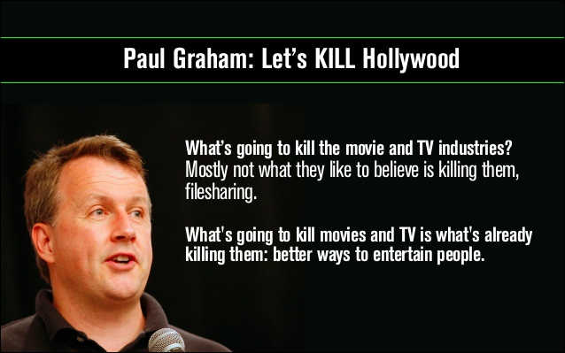
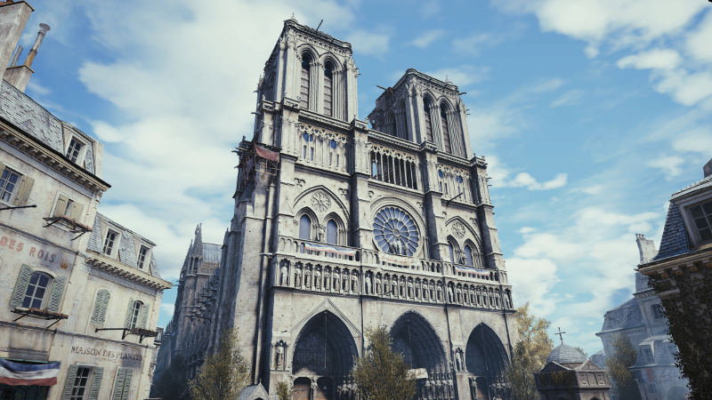
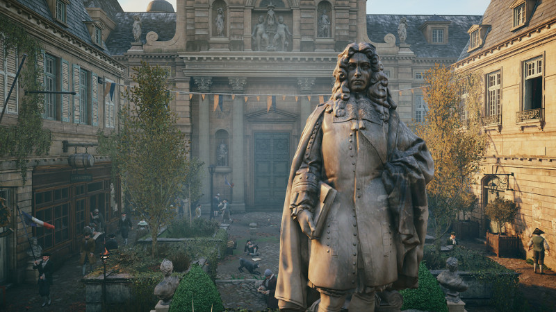
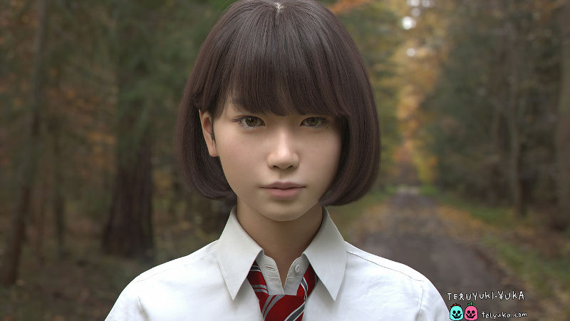
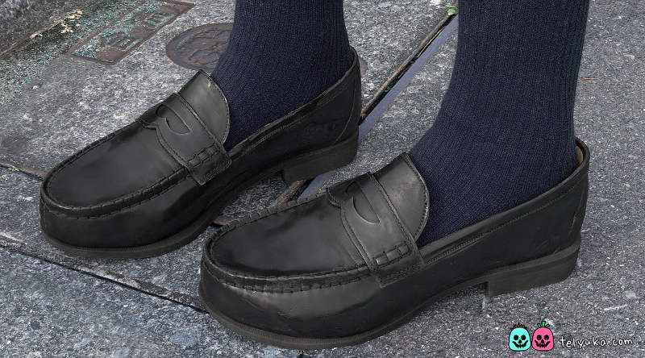
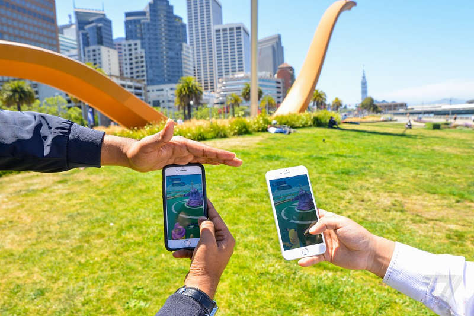
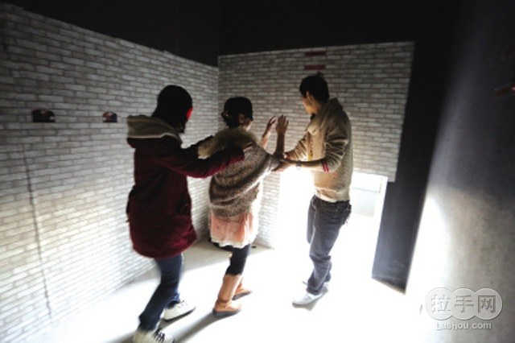

# 未来的娱乐业

一、

2012年1月份，美国风险投资家 Paul Graham 发表了一封[公开信](http://www.businessinsider.com/y-combinator-startups-please-hurry-up-and-kill-hollywood-2012-1?IR=T&r=US&IR=T)，题目很夸张，叫做“摧毁好莱坞”（kill Hollywood）。他希望创业公司投入娱乐行业的创新，跟好莱坞一比高下，甚至取代它。

当时，我读到这封信，心想怎么可能！

好莱坞代表了整个电影工业，已经发展了一百多年，高度成熟，怎么可能在以后几十年里面被取代，难道未来的人们不看电影？而且，那时中国的电影市场刚刚起步，电影在国内完全是朝阳产业。

Paul Graham 的核心观点是下面这句话。

> “电影行业正在死亡，互联网蓬勃兴起。未来会有更好的娱乐方式，让人们乐在其中，杀死电影和电视。”

他的意思是，未来会有比电影更有趣、更好玩的娱乐方式，导致电影消失。但是，这种新的娱乐方式是什么，他没说，说实话也不知道，只是相信一定会出现。

最近，我经常想起这句话，感到他的预言正在变成现实。我似乎已经有点知道了，比电影更好的娱乐是什么。

二、

请先思考一个问题。

>  电影与旅行的差异是什么？

回答是，电影是被动体验，旅行是主动体验。

电影（包括电视）需要观众坐在屏幕前，从头到尾看完节目。整个过程中，你都是被动的接收者，导演和编剧安排你看什么，你就必须看什么。基本上，电影的模式就是你坐在那里，等着看接下来什么情节发生。

旅行则是你拥有选择权，每一步都由自己决定。电影让你“看到”他人的生活，旅行则是让你“亲历”他人的生活。所以，它们不能互相替代。电影告诉你一个巴黎的故事，旅行让你走在巴黎的大街上，那是不一样的体验。

那么，能不能有一种新的娱乐方式，做到“电影 + 旅行”？我的意思是，它把电影和旅行结合为一体，让你在电影中旅行，在旅行中“亲历”电影。

三、

上周，我在玩一个叫做《刺客信条》的电子游戏。我扮演一个法国大革命时期的刺客，去完成一系列任务。

我操纵着游戏，在巴士底狱、凡尔塞宫、塞纳河、巴黎圣母院这些地方奔走，与路易十六、拿破仑、罗伯斯庇尔交谈。有那么一刻，当我在三级会议的会场外面，被皇家士兵拦住，一辆双轮马车擦身而过，扬起一片灰尘。我的头顶突然落下一阵水滴，那是洗衣女工晾塞在二楼窗外的破衣服。我不禁有点恍惚，仿佛身处1789年的巴黎。

（图片：电子游戏《刺客信条：大革命》的截图）

我觉得，游戏中的巴黎比真实的巴黎，更有巴黎的感觉。我去过欧洲，说实话，走在欧洲的马路上，跟走在国内的马路，没有太大的区别，无非就是人家的马路更窄、高楼更矮，建筑更漂亮而已。但是，这个游戏让我有强烈的身处异国他乡、风云际会的感觉。现在，我对巴黎大革命有了更深切的理解和体验，好像亲身参加了一遍。

计算机图形技术发展到今天，已经可以乱真。肉眼完全无法分辨，哪张是真实的照片，哪张是计算机生成的图片。计算机已经可以模拟一个虚拟世界，视觉上跟真实世界一模一样，而且像素更细腻、色彩更鲜艳，更讨人喜欢。

（图片：计算机图形已经可以乱真）

以前，计算机图像还只能在二维平面呈现，现在 VR 头盔出现了，让虚拟图像变成了一个三维立体的空间，敞开在你的周围，等待你的进入，而且你知道后面会有一个非常精彩的故事等着你。这是不是比电影或旅行更吸引人？

我并不是说，VR 游戏一定会取代电影或旅行，而是说它能提供电影或旅行没有的体验。这里的重点是，VR 游戏是一种可以在里面玩的电影，或者说可以让你在故事里面旅行。用户有着无与伦比的“参与感”。

美国科幻电视剧《西部世界》（WestWorld）更进一步，描述了一个大乐园，重现了十九世纪的西部拓荒生活，里面都是3D打印出来的智能机器人陪着游客玩。游客分辨不出，谁是真人，谁是机器人，除非事前知道。

四、

一般来说，“参与感”让一种活动变得更好玩。电子游戏和旅行让人产生“参与感”，电影、电视、剧场演出则属于无法参与，只能坐在舞台下观看。

娱乐业的发展史，就是让用户越来越多地参与进来。举例来说，你无法参与演唱会，只能坐在台下听歌星唱，人家唱什么，你听什么。于是出现了卡拉OK，让普通人也过一把高歌一曲的瘾，结果卡拉OK变成了比演唱会更大的行业。广场舞也是如此，自己跳舞比看别人跳舞过瘾多了。

为了让球迷参与球赛，出现了足球彩票。为了让观众参与网络视频，出现了弹幕。就连电子游戏，都在寻求玩家更深程度的参与。2016年的实境游戏“Pokemon Go”，要求玩家走上马路寻找宝贝，结果风靡了世界。你要玩这个游戏，就必须出门，在马路上掏出手机，到处寻找线索。你身边的真实世界就是游戏世界，你在游戏里遇到的人，就是在你对面的真实的人。

（图片：Pokemon Go 为现实世界的每样东西附加游戏属性）

任何一种活动，可以让普通人参与进来的门槛越低、程度越深，就越会大受欢迎。迪斯尼乐园总结出来的一条经营原则就是，“如果娱乐节目少一些被动性和纯观赏性，多一些亲身参与，游客就会停留地久一些。”。

一句话，娱乐业的发展方向，就是让消费者更多地参与进来。现在的电影模式做不到这一点，所以会被淘汰；VR 游戏允许消费者全身心参与，这才是未来的方向，VR 电影应该很快就会出现。

五、

马云说，十年以后中国最大的两个产业，是健康产业（Health）和文娱产业（Happy），简称“双H产业”。前者让人民更健康，后者让人民更快乐。

目前，人民关注的重点，还是生存条件和经济收入，等到这个阶段过去以后，就会改为关注生存质量。那时候，就会要求更高品质的娱乐活动。

未来的人们一定不会满足于，跑到电影院买票看电影，或者坐在电视机前，按着遥控器，一个个更换频道。他们要求“参与感”。现在的大城市里面，“密室逃脱”游戏广受欢迎，就证明了这一点。

（图片：密室逃脱是年轻人最喜欢的娱乐消费之一）

也许未来，你在网上订购了一段情节，就能进入一个全新的故事世界，这个世界有可能是真实的，也有可能是 VR 的，对你来说都一样，因为它们看上去几乎完全相同。你只知道，你在街头遇到的每个人、每件事，都是游戏安排好的。

