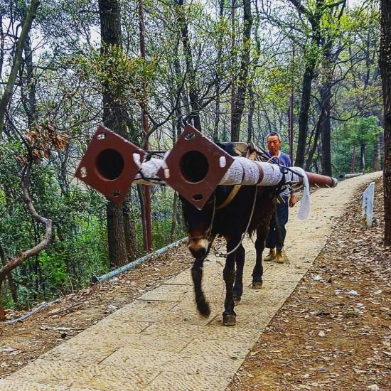

# 你的命运不是一头骡子

我在杭州工作，周末通常去爬山。

今年九月，这里将举办盛大的G20峰会。全城都在忙碌地筹备，山路上也不例外。距离西湖最近的一圈山头，都在安装照明设备，准备在夜间亮灯。

那些灯柱都是铸铁做的，高度六七米，非常沉重。施工队使用骡子，将灯柱从山脚运到峰顶。

我在山路上遇过好几次驮运设备的骡子。它们背上两边各绑着一根极重的灯柱，默默地低着头，蹒跚地踩在石阶上。等爬到峰顶，卸下设备以后，又返回山脚，驮运下一批。每头骡子的屁股后面，都跟着一个拿着木棍、看管它的施工人员，防止它走错路。

有一次，我看见一头骡子缓缓走着，突然停下来，低着头毫无表情地一动不动，不知道是累了还是不想走了。监工见状，立即拿棍子戳它，它茫然地抬起头，又顺从地继续向前走了。

看到这一幕，我非常感慨。骡子并不知道，为何要把如此重的铁管背到山顶，就是因为主人要求它这么做，就任劳任怨地干了。哪怕有那么一瞬间，它的内心有过一丝抗拒或疑问，主人一施压，它就不再追问了，回到正常的状态，默默地听任摆布。

我从这头骡子身上，想到很多人不也是这样，背负重压，被推着前行，却不知为何。他们埋头勤奋工作，努力完成上级交付的每一个任务，别人让你干什么就干什么，却没有思考过这一切到底为了什么。

说起来，中国人与骡子真的有很多相似性。一方面，许多人背上的生活压力，不会比那头骡子小多少，尤其是底层民众。另一方面，中国人的勤劳和忍耐能力，更是有过之而无不及。最重要的一点是，骡子只能接受现实，接受命运的安排，人又何尝不是如此呢？

不过，骡子是确实没有办法，它不会思考，没有能力抗拒命运的安排。人可以思考，也有行动能力。我感叹的是，那么多人心甘情愿地放弃，这种只有人类才具有的天赋，“自愿”像骡子那样活着，还说“这就是命，能有什么办法呢”，或者”我也不知道啊，除了这个，我还能干什么“。

读到这里，你也许会说，"哪有你说的那么严重，工作就是为了赚钱。什么接受命运的摆布、放弃思考能力。为了多赚一点钱努力工作，不是很合理吗，跟骡子扯得上关系吗？"

当然，在生存面前，一切都是合理的。骡子为了生存，必须俯首听命。但是，21世纪的中国青年，生存本身似乎已经不是问题了。在这样一个产能和资本过剩的时代，除了赚钱以外，是不是应该对自己的人生做一些认真的思考，不要让"赚钱"成为思想懒惰的借口。退一步说，就算你像骡子那样活着，真的赚到了很多钱，是否可以就此认定，当一头骡子是正确的事情？

说实话，我不太确定。假如有一道填空题，"如果因此可以获得彩票头奖，为什么不____呢？"，在下划线的地方填入"当一头骡子"，似乎逻辑上也说得过去。但从内心里，或者说基于我的偏执，我还是认为这样是不对的。

让我举一个实际的例子。我比较熟悉"软件工程师"这个职业，也就是职业程序员。在我看来，这种职业跟骡子有很多相似性，尤其在大公司里。因为大公司有严格的分工，设计师出视觉稿，业务部门提出需求和业务逻辑，产品经理负责项目实施，工程师的职责就是严格按照设计稿，将产品一模一样地实现出来。本质上，这跟骡子背铁管上山，并没有区别。

《黑客与画家》的作者保罗•格雷厄姆，做过一个非常好的概括。

> “......（你）只是一个负责实现领导意志的技术工人，职责就是根据规格说明书写出代码，其实与一个挖水沟的工人是一样的，从这头挖到那头，仅此而已，从事的都是机械性的工作。”

我不是说这样的流程有什么不对，而是说在这个流程里，人只是充当一种工具。就像骡子只是铁管上山的一种手段，你只是产出代码的一种手段，本身并没有"自由意志"体现在里面。或者说，你身上体现的都是他人的（或资本的）意志，你无法表现出自我。评价骡子的标准是，铁管背得比较多、比较快，评价软件工程师的标准又何尝不是如此呢，都是看是否忠实有效地实现那些外部意志。

我见过许多年轻的程序员勤奋工作，从早到晚一刻不停地编码，周末也来加班，努力完成公司的一个个目标，从来不问、甚至不想“这种需求对不对”、“这个功能有没有必要”，更不要说想一想“我的人生规划是什么”。中国的现实也很残酷，公司的哲学就是告诉你做什么，你就做什么，不想做就离开。

我可以想象，等到九月盛会召开时，工程完成，山头亮起灯光，与明月共同照映山脚下的西湖，平湖如镜，游人泛舟，夏夜凉风吹拂，何等的美景美事。骡子参与了这一切的创造过程，但是有谁会记得它们呢，它们的宿命就是接着去下一个工程背铁管。

更糟的是，当骡子老了、病了、残了，背不动钢管了，你觉得等待它的命运是什么？

骡子只是施工队的工具，跟锄头或者扁担没有本质区别。但你不是他人的工具，你活着不是为了被动地被他人使用，而是应该要有自己的价值。我觉得，人应该过一种有乐趣、有追求、自己做主的生活，而不能像骡子那样被推着走。

